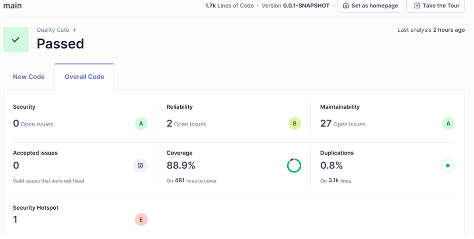
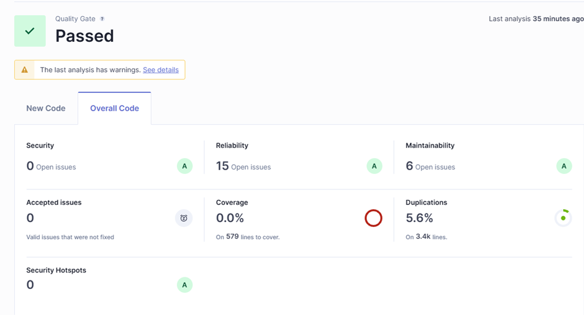
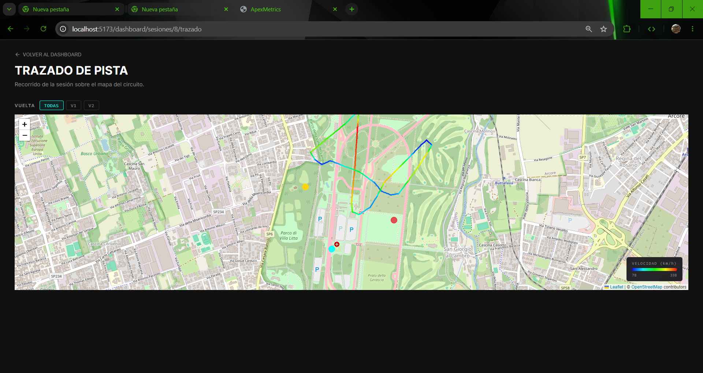
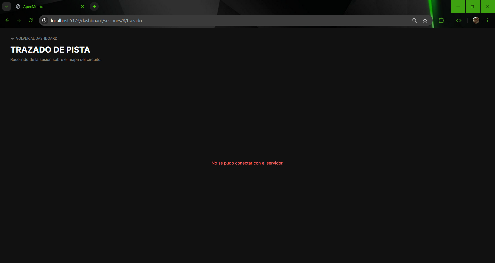

# Evidencias de Calidad — ApexMetrics — Hito 6

Este documento recopila las evidencias de las actividades de calidad realizadas
durante el **Hito 6 — Fase 2 (José Villablanca)**: análisis SonarQube, manejo
de errores en integración con API externa OSM, y las correcciones aplicadas
desde las observaciones del Hito 5.

---

## 1. SonarQube — Backend

**Proyecto:** `apexmetrics-backend`  
**Análisis ejecutado con:** `mvn clean verify sonar:sonar`

| Métrica | Valor | Calificación |
|---------|-------|--------------|
| Bugs (Reliability issues) | 2 | B |
| Vulnerabilidades (Security issues) | 0 | A |
| Security Hotspots | 1 | E (requiere revisión) |
| Code Smells (Maintainability) | 27 | A |
| Cobertura de código | 88.9% | Aceptada |
| Duplicaciones | 0.8% | Excelente |

> **[PEGAR CAPTURA]** — Captura del dashboard de SonarQube mostrando el
> estado del proyecto `apexmetrics-backend` con calificación de Quality Gate.
>
> Archivo de referencia: `sonarqube-backend.png`



---

## 2. SonarQube — Frontend

**Proyecto:** `apexmetrics-frontend`  
**Análisis ejecutado con:** `sonar-scanner` (tras `npm run test:cov`)

| Métrica | Valor | Calificación |
|---------|-------|--------------|
| Bugs (Reliability issues) | 15 | A |
| Vulnerabilidades (Security issues) | 0 | A |
| Security Hotspots | 0 | A |
| Code Smells (Maintainability) | 6 | A |
| Cobertura de código | 0.0% * | Requiere ajuste de ruta del reporte lcov |
| Duplicaciones | 5.6% | Aceptable |

> \* *Nota: La cobertura del frontend se ejecuta correctamente con Vitest, pero la carga a SonarQube requiere afinar la ruta relativa del archivo lcov.info según el directorio de trabajo del escáner.*
>
> **[PEGAR CAPTURA]** — Captura del dashboard de SonarQube mostrando el
> estado del proyecto `apexmetrics-frontend` con calificación de Quality Gate.
>
> Archivo de referencia: `sonarqube-frontend.png`



---

## 3. Acciones aplicadas desde Hito 5

Las siguientes mejoras fueron aplicadas en la rama `chore/hito6-devops`
basada en `dev` actualizado:

| # | Acción | Archivo modificado | Commit |
|---|--------|--------------------|--------|
| 1 | Agregar `healthcheck` al servicio `db` en docker-compose | `docker/docker-compose.yml` | `feat(docker): agregar healthcheck...` |
| 2 | Cambiar `depends_on` del backend a `condition: service_healthy` | `docker/docker-compose.yml` | (mismo commit) |
| 3 | Crear `docker/.env.example` con las 6 variables documentadas | `docker/.env.example` | `chore(docker): agregar .env.example...` |
| 4 | Crear script único `run-tests.sh` (backend + frontend) | `run-tests.sh` | `chore(ci): agregar run-tests.sh...` |
| 5 | Reescribir `README.md` con 10 secciones estructuradas | `README.md` | `docs(readme): reescribir...` |
| 6 | Eliminar `package-lock.json` huérfano de la raíz | `package-lock.json` | `chore: eliminar package-lock.json...` |

---

## 4. API externa — Mapa OSM funcionando

El componente `TrackMap` integra **OpenStreetMap** a través de `react-leaflet`.
La carga del mapa base se realiza correctamente y el trazado de telemetría se
superpone sobre el mapa.

> **[PEGAR CAPTURA]** — Captura del mapa mostrando el trazado de la sesión
> de telemetría sobre el fondo de OpenStreetMap, con la ruta visible.
>
> Archivo de referencia: `mapa-osm.png`



**Evidencia de la integración:**

- El componente usa tiles de `https://{s}.tile.openstreetmap.org/{z}/{x}/{y}.png`
  con atribución correcta a OpenStreetMap contributors.
- Al cargar una sesión con trazado, el mapa centra automáticamente en los
  primeros puntos GPS del circuito.

---

## 5. Manejo de errores de API externa

El componente `TrackMap` implementa manejo explícito de fallos al obtener
el trazado de la API interna (`GET /api/v1/telemetry/sesiones/{id}/trazado`):

| Escenario | Comportamiento |
|-----------|---------------|
| Respuesta vacía / sin puntos | Muestra mensaje: "No hay datos de trazado disponibles" |
| Error de red (fetch rechazado) | Captura el error en el bloque `catch` y muestra el mensaje de error |
| Error HTTP (4xx / 5xx) | Lee `ok` de la Response y lanza error con el status code |

> **[PEGAR CAPTURA]** — Captura mostrando el estado del componente cuando
> el backend devuelve un error o no hay puntos de trazado disponibles.
>
> Archivo de referencia: `mapa-osm-fallo.png`



**Fragmento relevante del código** (`frontend/src/components/TrackMap.tsx`):

```typescript
const response = await fetch(`/api/v1/telemetry/sesiones/${sessionId}/trazado`, {
  headers: { Authorization: `Bearer ${token}` },
});
if (!response.ok) {
  throw new Error(`Error ${response.status} al obtener trazado`);
}
const data: TrackPathDTO = await response.json();
if (!data.points || data.points.length === 0) {
  setError('No hay datos de trazado disponibles');
  return;
}
```

---

## Cómo reproducir el análisis SonarQube

```bash
# 1. Levantar SonarQube
docker compose -f docker/sonarqube-local.yml up -d

# 2. Esperar ~2 minutos y abrir http://localhost:9000
#    Credenciales: admin / admin
#    Crear proyectos: apexmetrics-backend y apexmetrics-frontend
#    Generar tokens desde Mi Cuenta → Seguridad → Generar Token

# 3. Ejecutar el análisis completo
bash run-quality.sh
# (o en Windows: .\run-quality.ps1)

# 4. Verificar resultados en http://localhost:9000
```
